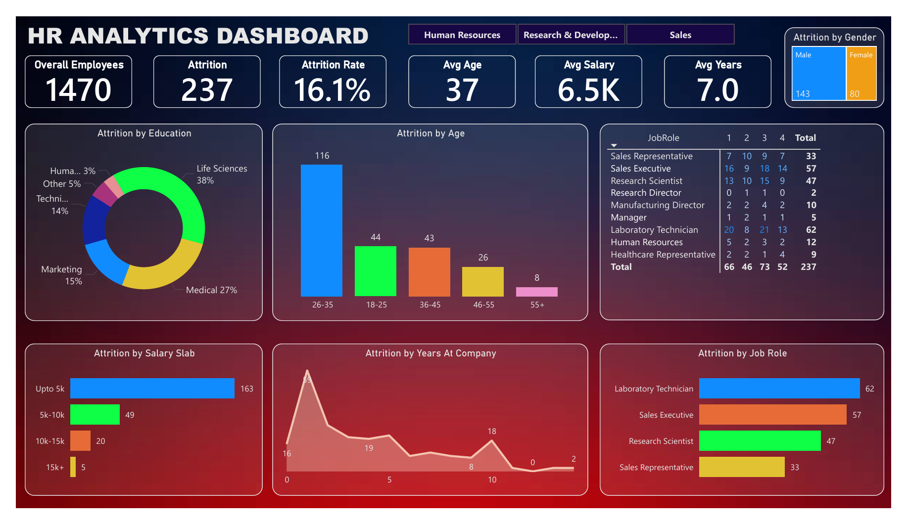

# HR Analytics Dashboard (Power BI)
Power BI dashboard analyzing employee attrition, workforce trends, and HR insights

## 📊 Overview
This project is an interactive Power BI dashboard designed to analyze employee attrition and workforce trends. It provides insights into employee behavior, job roles, and salary patterns to support data-driven HR decisions.

## 🚀 Key Features
- KPI tracking (Total Employees, Attrition, Attrition Rate)
- Attrition analysis by age, education, salary, and job role
- Gender-based attrition insights
- Interactive filters and slicers for dynamic analysis

## 📊 Business Insights
- Attrition rate is 16.1%
- Highest attrition occurs in the 26–35 age group
- Laboratory Technician and Sales Executive roles show the highest attrition
- Employees with salary upto 5k have the highest attrition

## 🛠 Tools Used
- Power BI  
- DAX (Data Analysis Expressions)  
- Data Modeling  
- Power Query  
- Microsoft Excel  

## 📷 Dashboard Preview

## 🔗 Project Link
[View Dashboard](https://drive.google.com/file/d/1-6I2dUoF89DPx0OubtQTFJp9lgQjiO5_/view?usp=drive_link)

## 📥 How to Use
Download the `.pbix` file and open it using Microsoft Power BI Desktop to explore the dashboard interactively.

